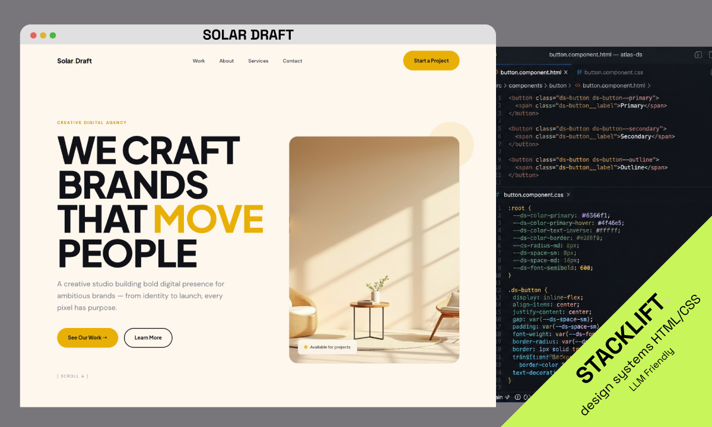

# The Stacklift Method

**I'm not a developer. I built a 20-kit design catalogue with Claude — every
kit visually unrelated to the next. This is the method.**

AI-generated design converges: dark canvas, lime accent, the same three
fonts, vertical scroll, three equal columns. Ask an LLM for a landing page
and you get *the* landing page.

This plugin is the fix I use in production at
[stacklift.design](https://www.stacklift.design). It guides Claude through
the method behind every kit in the catalogue:

1. **Decode the inspiration** — extract the real mechanism, not the surface.
2. **Pick ONE rupture axis** — eight deliberate ways to break the AI default
   ([the framework](skills/kit-method/references/rupture-axes.md)).
3. **Forge an original identity** — dedicated palette and fonts, hard taste
   rules (never Inter, never `#000000`, never the AI purple).
4. **Build a living, self-contained site** — one HTML file, real navigation,
   one signature gesture, rest zones around it.
5. **Ship it with a design.md** — so any AI agent can adapt the kit later
   without breaking it.

## Install

```
/plugin marketplace add earthmoon-app/stacklift-method
/plugin install stacklift-method@stacklift-method
```

Then ask Claude — the method has two entry points:

- **Create** (the **kit-method** skill): *"Build a design kit from this inspiration: …"*
- **Redesign** (the **redesign** skill): *"Redesign my existing site — keep my copy, make it
  distinctive: …"* — Claude inventories your site, audits it against the
  rupture axes, locks what must be preserved (copy, structure, optionally
  your brand), then rebuilds it around ONE axis as self-contained pages plus
  a `design.md`, next to your site — your files are never touched.

## What it produces

A complete kit like this one — included in [`example/`](example/README.md):



Open [`example/solar-draft/index.html`](example/solar-draft/index.html) by
double-click: self-contained HTML, a Design System view, and a
[`design.md`](example/solar-draft/design.md) an AI agent can work from.

## The method in three files

- [`rupture-axes.md`](skills/kit-method/references/rupture-axes.md) — the
  anti-convergence framework: eight axes, with published examples for most.
- [`quality-doctrine.md`](skills/kit-method/references/quality-doctrine.md) —
  the taste rules ("sober > gadget") and the validation checklist.
- [`design-md-format.md`](skills/kit-method/references/design-md-format.md) —
  the design.md format that makes a kit adaptable.

## Or skip the work

The method is free. The finished kits are 29 € each — 20+ kits, one per
rupture axis, ready to hand to your AI agent:
**[stacklift.design](https://www.stacklift.design)** · how a buyer adapts a
kit in one hour: [the case study](https://www.stacklift.design/adapt).

---

MIT — attribution appreciated. Kits you build with the method are yours.
